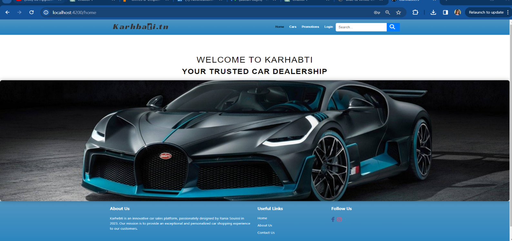
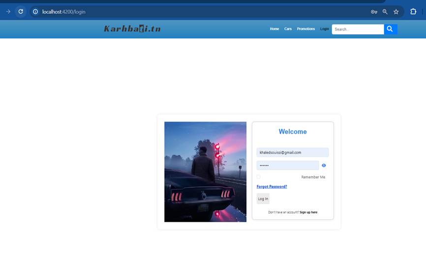
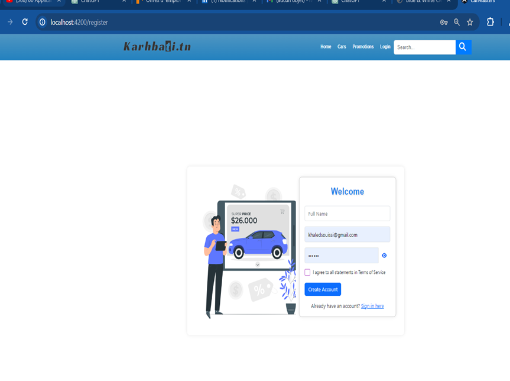
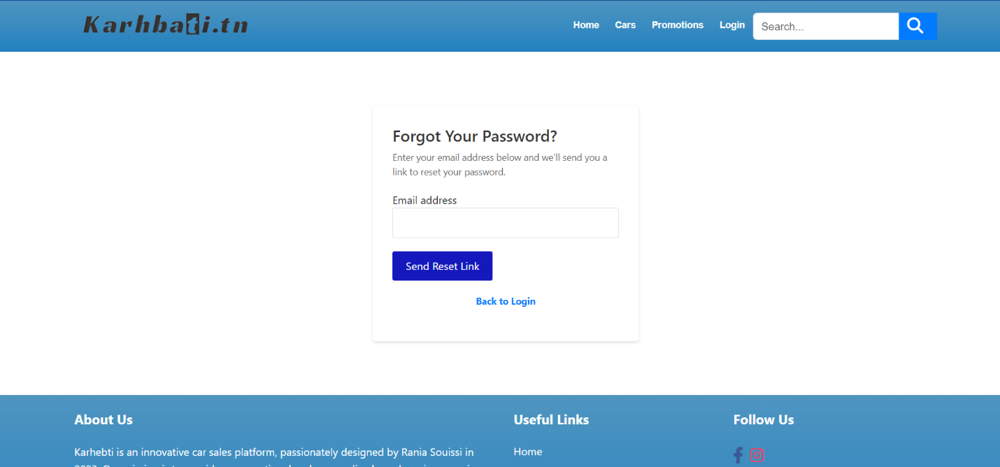

# Karhabti - Application Web pour une Agence de Vente de Voitures

**Karhabti** est une application web complète pour la gestion d'une agence de vente de voitures. Ce projet comprend des fonctionnalités telles que l'authentification des utilisateurs, la gestion des véhicules à vendre, et l'administration des commandes. L'application a été développée en utilisant **NestJS** pour le backend et **AngularJS** pour le frontend. 

Les fonctionnalités du frontend n'ont pas été complètement implémentées en raison de contraintes de temps, mais l'application est fonctionnelle du côté backend et inclut des fonctionnalités telles que l'inscription, la connexion, la gestion des utilisateurs, et l'authentification JWT.


## Aperçu de l'application

### Page d'accueil



### Page de Connexion
Page de connexion permettant aux utilisateurs de s'authentifier.



### Page d'Inscription
Page d'inscription pour les nouveaux utilisateurs.



### Mot de Passe Oublié
Page permettant aux utilisateurs de récupérer leur mot de passe.




---

## Fonctionnalités

- **Backend complet** avec NestJS : gestion des utilisateurs, gestion des véhicules, gestion des commandes, et plus encore.
- **Frontend partiel** avec AngularJS : implémentation des pages d'inscription, de connexion, de mot de passe oublié et de gestion des utilisateurs.
- **Authentification sécurisée** avec **JWT** (JSON Web Token) pour une gestion des sessions sécurisée.
- **Emails de récupération de mot de passe** via **Mailtrap**.

## Technologies utilisées

- **Backend** : NestJS
- **Frontend** : AngularJS
- **Base de données** : MongoDB
- **Authentification** : JWT
- **Emailing** : Mailtrap (pour la gestion des emails)

---

## Installation

### Backend
1. Clonez le projet :
   ```bash
   git clone https://github.com/raniasouissi/Karhabti-Application-Web-pour-une-Agence-de-Vente-de-Voitures.git
